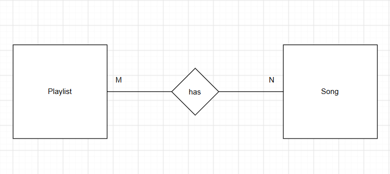
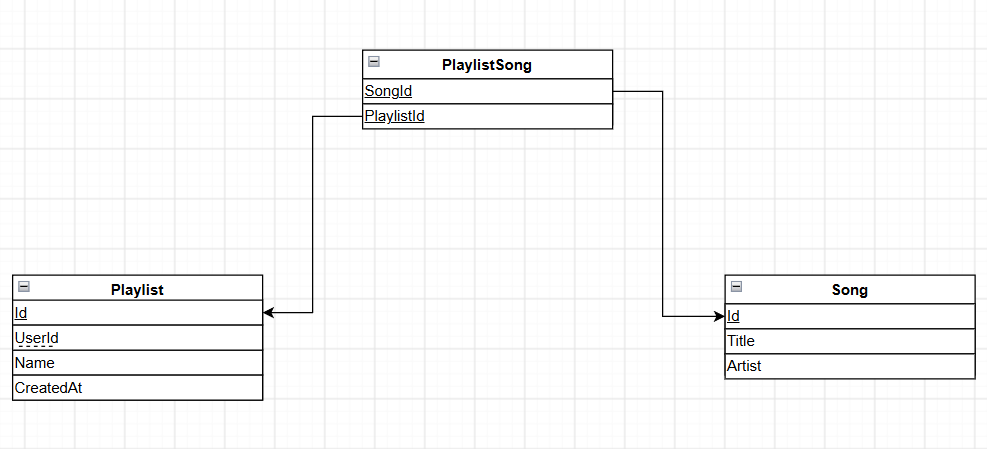

# luftborn-technical-test

ASP.NET Core (.NET 10) Web API for a songs/playlists catalog, backed by SQL Server (EF Core).
The whole stack is containerized: one command starts both the API and a SQL Server database.

## API overview

Full API documentation: [docs/API.md](docs/API.md)

## Requirements

- [Docker Desktop](https://www.docker.com/products/docker-desktop/) (includes Docker Compose) — Windows, macOS, or Linux
- No .NET SDK or SQL Server installation needed

## Run with Docker (recommended)

1. Clone the repository:

   ```bash
   git clone https://github.com/OmarNaru1110/luftborn-technical-test.git
   cd luftborn-technical-test
   ```

2. From the repository root, start the stack:

   ```bash
   docker compose up --build
   ```

What happens:

1. Builds the API image from the `Dockerfile`
2. Starts a SQL Server 2022 container with a persistent data volume
3. Waits until SQL Server is healthy, then starts the API
4. The API applies EF Core migrations and seeds sample songs automatically on first run

When it's up:

| Service    | URL                                        |
| ---------- | ------------------------------------------ |
| Swagger UI | http://localhost:8080/swagger              |
| OpenAPI spec | http://localhost:8080/openapi/v1.json    |
| API        | http://localhost:8080/api/...              |

Quick smoke test:

```bash
curl http://localhost:8080/api/songs
```

Stop everything (keeps database data):

```bash
docker compose down
```

Stop and delete the database volume as well:

```bash
docker compose down -v
```

### Custom SA password

The default SQL Server `sa` password is `Your_strong_P@ssw0rd`. To use your own, create a `.env` file in the repository root (next to `docker-compose.yml`):

```bash
MSSQL_SA_PASSWORD=My_Other_P@ssw0rd
```

The password must satisfy SQL Server complexity rules (min 8 chars, uppercase, lowercase, digit, symbol).

> The SQL Server container is also reachable from the host on port `1533` (`localhost,1533`), handy for SSMS/Azure Data Studio. If that port is taken, change the `ports` mapping of the `sqlserver` service in `docker-compose.yml` — the API reaches it through the internal Docker network anyway.

## Run without Docker (local development)

Requirements: .NET SDK 10 and a reachable SQL Server instance.

1. Set the connection string (environment variable or `dotnet user-secrets`):

   ```bash
   # PowerShell
   $env:SQLServer_ConnectionString = "Server=localhost;Database=LuftbornDb;Trusted_Connection=True;TrustServerCertificate=True;MultipleActiveResultSets=True"
   ```

   Alternatively, copy `API/API/.env.example` to `API/API/.env` and fill in your connection string (loaded automatically by DotNetEnv).

2. Run the API (migrations + seed run automatically):

   ```bash
   dotnet run --project API/API
   ```

3. Open http://localhost:5129/swagger (HTTP profile) or https://localhost:7065/swagger.

Run the unit tests:

```bash
dotnet test UnitTests
```

## Project structure

```
API/      ASP.NET Core Web API (controllers, services, Program.cs)
CORE/     Domain/application services
DATA/     EF Core DbContext, models, migrations (SQL Server)
UnitTests NUnit tests
docs/     API documentation and diagrams
```

## Database

The schema is defined code-first with EF Core in the `DATA` project and applied to SQL Server through migrations on startup.
### ERD

### Mapping Diagram


### Tables

**Songs**

| Column | Type          | Constraints  |
| ------ | ------------- | ------------ |
| Id     | int           | PK, identity |
| Title  | nvarchar(100) | required     |
| Artist | nvarchar(100) | required     |

**Playlists**

| Column    | Type          | Constraints  |
| --------- | ------------- | ------------ |
| Id        | int           | PK, identity |
| Name      | nvarchar(100) | required     |
| UserId    | int           | indexed      |
| CreatedAt | datetime2     |              |

**PlaylistSongs** (join table)

| Column     | Type | Constraints                                     |
| ---------- | ---- | ----------------------------------------------- |
| PlaylistId | int  | composite PK, FK → Playlists.Id, cascade delete |
| SongId     | int  | composite PK, FK → Songs.Id, cascade delete     |

### Relationships

- **Playlists ↔ Songs** — many-to-many, implemented through the `PlaylistSongs` join table.
- **Cascade deletes** — deleting a playlist removes its rows from `PlaylistSongs`, and deleting a song detaches it from every playlist that contained it. The songs/playlists themselves are never deleted through the relationship.

```
Playlists 1 ──── * PlaylistSongs * ──── 1 Songs
```

### Indexes

| Index                   | Table         | Purpose                                                                                     |
| ----------------------- | ------------- | ------------------------------------------------------------------------------------------- |
| PK (clustered)          | all tables    | fast lookups by primary key; `PlaylistSongs` uses a composite key `(PlaylistId, SongId)`     |
| `IX_Playlists_UserId`   | Playlists     | the most common query pattern: fetch all playlists for a user                                |
| `IX_PlaylistSongs_SongId` | PlaylistSongs | reverse lookup ("which playlists contain this song") plus efficient FK cascade deletes      |

The composite primary key on `PlaylistSongs` also serves as an index for the forward direction ("all songs in playlist X").

### Why a relational database?

I chose an RDBMS (SQL Server) over NoSQL alternatives for several reasons:

- **Great fit with EF Core**: EF Core's LINQ-to-SQL translation, change tracking, and migrations are first-class for relational databases, which keeps data access clean and type-safe.
- **Familiarity**: relational databases are what I have the most experience with, so development was faster.
- **Simple access patterns**: relationships here are straightforward and queries need very few joins, so there's no need for denormalization or the flexibility of a document store.
- **Highly structured data**: songs and playlists have fixed, well-defined shapes; a relational schema enforces that structure with strong typing and referential integrity via foreign keys.

## Tech stack

- ASP.NET Core (.NET 10) Web API
- EF Core + SQL Server 2022 (code-first migrations)
- NUnit unit tests
- Docker / Docker Compose

## Architecture

Classic three-layer layout:

- **API** — controllers, DTOs, DI registration; thin HTTP layer
- **CORE** — business logic via services (`SongService`, `PlaylistService`)
- **DATA** — EF Core `AppDbContext`, entity configurations, generic repository + unit of work

Controllers depend on services, services on `IUnitOfWork`, keeping HTTP concerns separate from persistence.

> **Simulated auth:** there is no real authentication in this test project. Playlists belong to users via `ICurrentUser`, whose only implementation (`API/API/Services/CurrentUser.cs`) is a stub registered in DI that always returns user id `1`. Replacing that single class with one that reads the id from a JWT/session is all real auth would need.

## Testing

Unit tests (NUnit) cover controllers, services, and the repository layer. They use an EF Core InMemory provider and Moq, so no database or Docker is required to run them.

From the repository root:

```bash
dotnet test UnitTests
```

## AI-assisted development

This project was developed with assistance from AI coding agents. The full conversation logs are preserved in [ai-transcripts/](ai-transcripts/)

Models used:

- **big-pickle**
- **Gemini 3.1 Pro**
